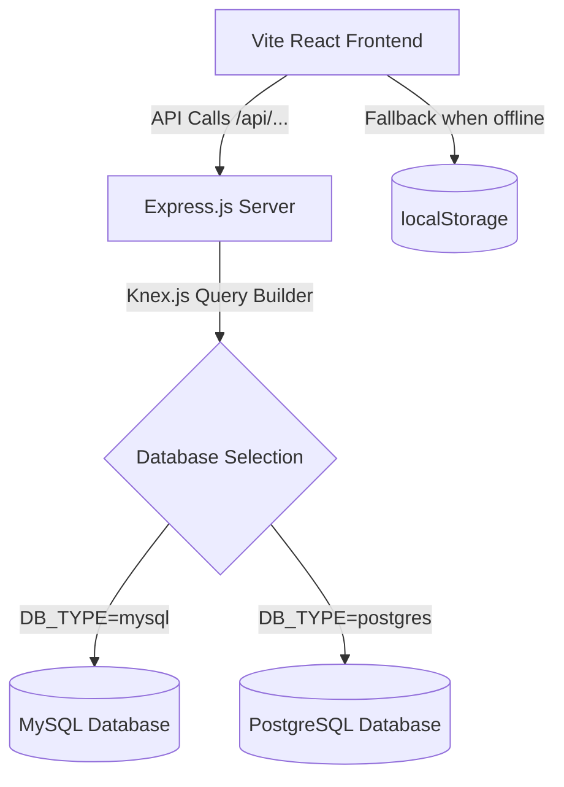

# 📊 SmartMarkt Database Integration Plan (MySQL & PostgreSQL)

This plan outlines the design and integration of a relational database backend (supporting both **MySQL** and **PostgreSQL**) for the SmartMarkt POS & Accounting application.

---

## 🏗️ Architecture Overview

Currently, SmartMarkt operates entirely in the browser using `localStorage`. To support physical databases, we will introduce a lightweight **Node.js/Express API Server** in a new `/server` folder.



### Key Highlights
1. **Dynamic DB Switching**: We will use [Knex.js](https://knexjs.org/) as a query builder. By changing the environment variable `DB_TYPE` to `mysql` or `postgres`, the server will instantly switch database engines.
2. **Auto-Migrations**: The server will automatically build the required tables upon startup if they do not exist, eliminating manual SQL table creation steps.
3. **Offline-First Fallback**: If the API server is unreachable, the frontend will automatically fall back to `localStorage`, keeping the app operational.

---

## 🗄️ Database Schema Design

We will map the existing client-side JSON structures to relational database tables.

```mermaid
erDiagram
    store_info {
        string nameAr
        string nameEn
        string vatNumber PK
        string phone
        string address
    }
    users {
        string id PK
        string username UNIQUE
        string nameAr
        string nameEn
        string role
        boolean active
    }
    products {
        string id PK
        string barcode UNIQUE
        string nameAr
        string nameEn
        string category
        decimal costPrice
        decimal sellingPrice
        integer quantity
        string unit
        integer lowStockThreshold
        date expiryDate
        boolean isPerishable
    }
    suppliers {
        string id PK
        string name
        string phone
        string email
        string vatNumber
        decimal balance
    }
    purchase_orders {
        string id PK
        string poNumber UNIQUE
        datetime date
        string supplierId FK
        string supplierName
        decimal total
        string status
        datetime receivedDate
    }
    purchase_order_items {
        integer id PK
        string poId FK
        string productId FK
        string productNameAr
        string productNameEn
        decimal costPrice
        integer quantity
        decimal total
    }
    invoices {
        string id PK
        string invoiceNumber UNIQUE
        datetime date
        decimal subtotal
        decimal discountAmount
        decimal vatAmount
        decimal total
        string paymentMethod
        decimal cashAmount
        decimal cardAmount
        text zatcaQrCode
        string cashierId FK
        string cashierName
    }
    invoice_items {
        integer id PK
        string invoiceId FK
        string productId FK
        string nameAr
        string nameEn
        integer quantity
        decimal sellingPrice
        decimal costPrice
        decimal discount
        decimal taxRate
        decimal subtotal
        decimal vatAmount
        decimal total
    }
    audit_logs {
        string id PK
        datetime timestamp
        string userId FK
        string userName
        string role
        string action
        text details
    }

    suppliers ||--o{ purchase_orders : "supplements"
    purchase_orders ||--|{ purchase_order_items : "contains"
    invoices ||--|{ invoice_items : "contains"
    users ||--o{ invoices : "processes"
    users ||--o{ audit_logs : "triggers"
```

---

## 📂 Proposed File Changes & Folder Structure

We will create a new `/server` directory and modify `/src/services/db.ts` to interact with the backend API.

```
appPrompt/
├── package.json
├── src/
│   ├── services/
│   │   └── db.ts             <-- [Modify] Add Fetch/API layer, fallback to LocalStorage
├── server/                    <-- [New Folder] Backend API
│   ├── package.json           <-- Backend package & dependencies
│   ├── tsconfig.json          <-- TypeScript configuration for backend
│   ├── .env.example           <-- DB configurations template
│   └── src/
│       ├── index.ts           <-- Express Server (routes and listener)
│       ├── db.ts              <-- Knex Connection Pool
│       ├── migrations.ts      <-- Database DDL (Table migrations builder)
│       └── types.ts           <-- Typed request handlers
```

---

## 🔧 Planned Code Implementations

### 1. Backend Server Setup
We will set up an Express.js server inside the `/server` folder. The database connection setup using Knex will look like this:

```typescript
// server/src/db.ts
import knex from 'knex';
import dotenv from 'dotenv';
dotenv.config();

const dbType = process.env.DB_TYPE || 'postgres';

export const db = knex({
  client: dbType === 'postgres' ? 'pg' : 'mysql2',
  connection: {
    host: process.env.DB_HOST || '127.0.0.1',
    user: process.env.DB_USER || 'root',
    password: process.env.DB_PASSWORD || '',
    database: process.env.DB_NAME || 'smartmarkt',
    port: Number(process.env.DB_PORT) || (dbType === 'postgres' ? 5432 : 3306),
  },
  useNullAsDefault: true,
});
```

### 2. Auto-Migration Script
To ensure easy deployment, `migrations.ts` will check if tables exist on startup and build them automatically using Knex Schema Builder. For example:
```typescript
// server/src/migrations.ts
import { db } from './db';

export async function runMigrations() {
  const hasProducts = await db.schema.hasTable('products');
  if (!hasProducts) {
    await db.schema.createTable('products', (table) => {
      table.string('id').primary();
      table.string('barcode').unique().notNullable();
      table.string('nameAr').notNullable();
      table.string('nameEn').notNullable();
      table.string('category').notNullable();
      table.decimal('costPrice', 10, 2).notNullable();
      table.decimal('sellingPrice', 10, 2).notNullable();
      table.integer('quantity').notNullable().defaultTo(0);
      table.string('unit').notNullable();
      table.integer('lowStockThreshold').defaultTo(10);
      table.string('expiryDate');
      table.boolean('isPerishable').defaultTo(false);
    });
  }
  // Repeat for users, suppliers, invoices, items, logs, and settings...
}
```

### 3. Frontend `dbService` Integration
We will update `src/services/db.ts` to attempt fetching from the backend API. If the API is offline or returns an error, it seamlessly falls back to `localStorage` (supporting offline execution out-of-the-box).

```typescript
// Example pattern in src/services/db.ts
const API_URL = 'http://localhost:3001/api';

async function checkBackendStatus(): Promise<boolean> {
  try {
    const res = await fetch(`${API_URL}/status`, { signal: AbortSignal.timeout(1000) });
    return res.ok;
  } catch {
    return false;
  }
}

export const dbService = {
  // Existing init logic here ...

  async getProducts(): Promise<Product[]> {
    if (await checkBackendStatus()) {
      const res = await fetch(`${API_URL}/products`);
      return res.json();
    }
    // Fallback to LocalStorage
    return JSON.parse(localStorage.getItem(KEYS.PRODUCTS) || '[]');
  },

  async saveProduct(product: Product): Promise<Product> {
    if (await checkBackendStatus()) {
      const res = await fetch(`${API_URL}/products`, {
        method: 'POST',
        headers: { 'Content-Type': 'application/json' },
        body: JSON.stringify(product),
      });
      return res.json();
    }
    // Fallback to LocalStorage CRUD
    // ...
  }
};
```

---

## 🚀 Execution & Verification Steps

1. **Backend Initialization**:
   - Install database dependencies: `npm install knex mysql2 pg express cors dotenv tsx`.
   - Setup typescript configurations for the backend.
2. **Launch Databases**:
   - The user (you) can start a local instance of PostgreSQL or MySQL.
   - Configure `.env` with variables (e.g. `DB_TYPE=postgres`, `DB_HOST=localhost`, etc.).
3. **Run API Server**:
   - Execute `npm run dev` in `/server`.
   - The server boots up, automatically builds all tables, and serves `/api/*` endpoints.
4. **Vite App Dev**:
   - The React app detects the running server and loads/saves data directly to the MySQL/PostgreSQL database!
